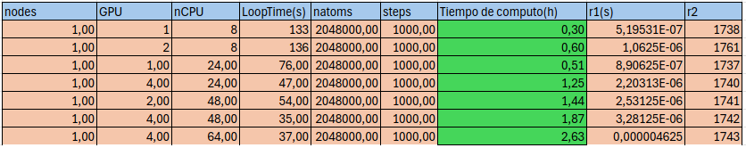
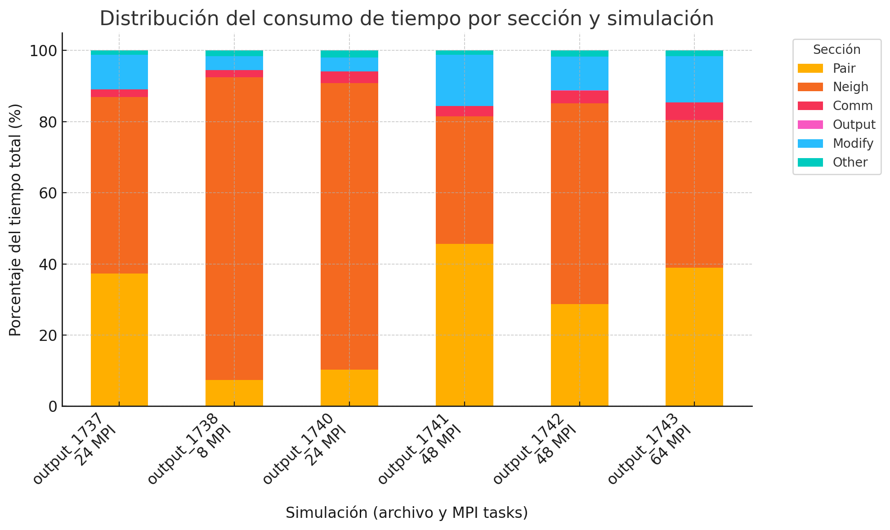

# 🧪 CLEMENTINA-XXI Test Guide: LAMMPS + GPU

Esta guía explica cómo ejecutar una simulación simple de cobre FCC con LAMMPS en la infraestructura de Clementina usando 1 nodo con 1 GPU y 24 CPUs.

## ✅ Paso 0: Activar VPN(openvpn)
 Esta terminal queda activa aparte de las demas.
```
 sudo openfortivpn vpn.clementinaxxi.org.ar:PORT   --username user   --password 'pass'   --trusted-cert 'cert'   --set-dns=1   --set-routes=1

```

---
## ✅ Paso 1: Conectarse a Clementina

Desde tu terminal local con VPN activa:

```bash
ssh usuario@ssh.clementinaxxi.org.ar
```

---

## ✅ Paso 2: Crear un directorio de trabajo y subir los archivos

En Clementina:

```bash
mkdir -p ~/LAMMPS_CU_FCC
cd ~/LAMMPS_CU_FCC
```

Desde tu máquina local:

```bash
scp in.fcc_cu_anneal.txt run_gpu_cu.slurm usuario@ssh.clementinaxxi.org.ar:~/LAMMPS_CU_FCC
```

---

---

## ✅ Paso 3: Revisar el input

Asegurate de que el archivo `in.fcc_cu_anneal.txt` contenga esta línea (ya apunta al potencial correcto):

```lammps
pair_coeff * * /data/shared/apps/lammps/2024-ocl-most/potentials/Cu_u3.eam
```

---

## ✅ Paso 4: Enviar el trabajo a SLURM

```bash
sbatch run_gpu_cu.slurm
```

---

## ✅ Paso 5: Monitorear la simulación (opcional)

```bash
tail -f anneal_ni.out
```

---

## ✅ Paso 6: Descargar resultados a tu máquina local

```bash
scp -r usuario@ssh.clementinaxxi.org.ar:~/LAMMPS_CU_FCC ~/Escritorio/
```

---

## 🧩 Archivos necesarios

- [`in.fcc_cu_anneal.txt`](./in.fcc_cu_anneal.txt)
- [`run_gpu_cu.slurm`](./run_gpu_cu.slurm)
- 


.png)
---

> 🧠 **Tip:** Si `Ave neighs/atom = 0`, revisá que estés usando `neigh no` en `run_gpu_cu.slurm` para evitar problemas con la construcción de vecinos en GPU.
